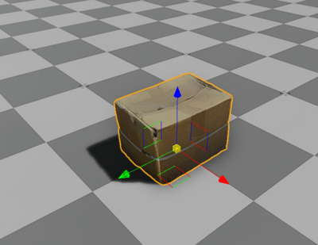
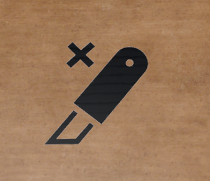
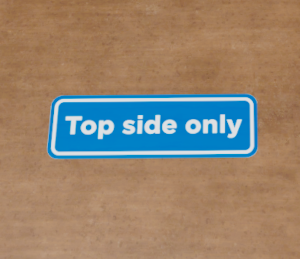
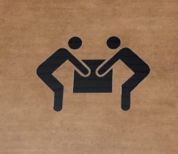

# robotec-warehouse-assets
Repository for all warehouse specific O3DE assets

# Repository content

This repository contains O3DE gems with assets that are specific to warehouse area.

## RobotecWarehouseBarriersAndCagesAssets
Asset gem with barriers and cages

## RobotecWarehouseBuildingAssets
Asset gem with warehouse buildings and construction elements

## RobotecWarehouseForkliftsAssets
Asset gem with forklifts

## RobotecWarehouseLaddersStairsAssets
Asset gem with ladders and stairs

## RobotecWarehouseMiscAssets
Asset gem with miscellaneous warehouse assets

## RobotecWarehousePayloadAssets
Asset gem with payloads for warehouse operations. Includes objects that can be placed  on the shelves, like pallets, boxes, and other items.

### Assets:

#### CardboardBox01_v00


Features: Dynamic rigid body, collider

#### CardboardBox01_v01


Features: Dynamic rigid body, colliders

#### CardboardBox01_v02D


Features: Dynamic rigid body, colliders

#### CardboardBox01_v03


Features: Dynamic rigid body, colliders

#### CardboardBox01_v04


Features: Dynamic rigid body, collider

#### CardboardBox01_v05


Features: Dynamic rigid body, collider

#### CardboardBox01_v06D


Features: Dynamic rigid body, collider

#### CardboardBox02_v00


Features: Dynamic rigid body, colliders

#### CardboardBox02_v01


Features: Dynamic rigid body, colliders

#### CardboardBox02_v02D


Features: Dynamic rigid body, colliders

#### CardboardBox02_v03


Features: Dynamic rigid body, colliders

#### CardboardBox02_v04D


Features: Dynamic rigid body, colliders

#### CardboardBox03_v01


Features: Dynamic rigid body, colliders

#### CardboardBox03_v02O


Features: Dynamic rigid body, colliders

#### CardboardBox03_v03O


Features: Dynamic rigid body, colliders

#### CardboardBox04_v01


Features: Dynamic rigid body, colliders

#### CardboardBox05_v01


Features: Dynamic rigid body, colliders

#### CardboardBox06_v01


Features: Dynamic rigid body, colliders

#### CardboardBox07_v01


Features: Dynamic rigid body, colliders

#### CardboardBox08_v01


Features: Dynamic rigid body, colliders

#### CardboardBox09_v01


Features: Dynamic rigid body, colliders

#### ContainerPlasticRed01


Features: Dynamic rigid body, colliders

#### EuroPallet01_v00


Features: Dynamic rigid body, colliders

#### EuroPallet02_v00


Features: Dynamic rigid body, colliders

#### EuroPallet01_v01


Features: Dynamic rigid body, colliders


#### Decal_AvoidMoisture_512
#### Decal_AvoidMoisture_256


Features: prefabs with decal, 2 available sizes of the texture: 256x256px and 512x512px

#### Decal_CarefulFragileContents_512
#### Decal_CarefulFragileContents_256


Features: prefabs with decal, 2 available sizes of the texture: 256x256px and 512x512px

#### Decal_CEMark_512_BW
#### Decal_CEMark_256_BW


Features: prefabs with decal, 2 available sizes of the texture: 256x256px and 512x512px

#### Decal_DoNotBend_512
#### Decal_DoNotBend_256


Features: prefabs with decal, 2 available sizes of the texture: 256x256px and 512x512px

#### Decal_DoNotCrush_512
#### Decal_DoNotCrush_256


Features: prefabs with decal, 2 available sizes of the texture: 256x256px and 512x512px

#### Decal_DoNotOpenWithKnife_512_BW
#### Decal_DoNotOpenWithKnife_256_BW



Features: prefabs with decal, 2 available sizes of the texture: 256x256px and 512x512px

#### Decal_DoNotPile_512
#### Decal_DoNotPile_256


Features: prefabs with decal, 2 available sizes of the texture: 256x256px and 512x512px

#### Decal_Fragile_512
#### Decal_Fragile_256


Features: prefabs with decal, 2 available sizes of the texture: 256x256px and 512x512px

#### Decal_Fragile_512_BW
#### Decal_Fragile_256_BW


Features: prefabs with decal, 2 available sizes of the texture: 256x256px and 512x512px

#### Decal_HandleWIthCare_512
#### Decal_HandleWIthCare_256


Features: prefabs with decal, 2 available sizes of the texture: 256x256px and 512x512px

#### Decal_HandleWIthCare_512_BW
#### Decal_HandleWIthCare_256_BW


Features: prefabs with decal, 2 available sizes of the texture: 256x256px and 512x512px

#### Decal_InspectContents_512
#### Decal_InspectContents_256


Features: prefabs with decal, 2 available sizes of the texture: 256x256px and 512x512px

#### Decal_MobiusLoop_512_BW
#### Decal_MobiusLoop_256_BW


Features: prefabs with decal, 2 available sizes of the texture: 256x256px and 512x512px

#### Decal_OpenGently_512
#### Decal_OpenGently_256


Features: prefabs with decal, 2 available sizes of the texture: 256x256px and 512x512px

#### Decal_PackedUnderWatch_512
#### Decal_PackedUnderWatch_256


Features: prefabs with decal, 2 available sizes of the texture: 256x256px and 512x512px

#### Decal_ProtectFromHeat_512
#### Decal_ProtectFromHeat_256


Features: prefabs with decal, 2 available sizes of the texture: 256x256px and 512x512px

#### Decal_ShippingLabel_01_512
#### Decal_ShippingLabel_01_256


Features: prefabs with decal, 2 available sizes of the texture: 256x256px and 512x512px

#### Decal_ShippingLabel_02_512
#### Decal_ShippingLabel_02_256


Features: prefabs with decal, 2 available sizes of the texture: 256x256px and 512x512px

#### Decal_ShippingLabel_03_512
#### Decal_ShippingLabel_03_256


Features: prefabs with decal, 2 available sizes of the texture: 256x256px and 512x512px

#### Decal_ShippingLabel_04_512
#### Decal_ShippingLabel_04_256


Features: prefabs with decal, 2 available sizes of the texture: 256x256px and 512x512px

#### Decal_ShippingLabel_05_512
#### Decal_ShippingLabel_05_256


Features: prefabs with decal, 2 available sizes of the texture: 256x256px and 512x512px

#### Decal_KeepDry_512
#### Decal_KeepDry_256


Features: prefabs with decal, 2 available sizes of the texture: 256x256px and 512x512px

#### Decal_KeepDry_512_BW
#### Decal_KeepDry_256_BW


Features: prefabs with decal, 2 available sizes of the texture: 256x256px and 512x512px

#### Decal_KeepFlat_512
#### Decal_KeepFlat_256


Features: prefabs with decal, 2 available sizes of the texture: 256x256px and 512x512px

#### Decal_KeepUpright_512
#### Decal_KeepUpright_256


Features: prefabs with decal, 2 available sizes of the texture: 256x256px and 512x512px

#### Decal_KeepAwayFromSunlight_512
#### Decal_KeepAwayFromSunlight_256


Features: prefabs with decal, 2 available sizes of the texture: 256x256px and 512x512px

#### Decal_Tidyman_512
#### Decal_Tidyman_256


Features: prefabs with decal, 2 available sizes of the texture: 256x256px and 512x512px

#### Decal_TopSideOnly_512
#### Decal_TopSideOnly_256



Features: prefabs with decal, 2 available sizes of the texture: 256x256px and 512x512px

#### Decal_TwoPersonLift_512_BW
#### Decal_TwoPersonLift_256_BW



Features: prefabs with decal, 2 available sizes of the texture: 256x256px and 512x512px

#### Decal_ThisWayUp_512_BW
#### Decal_ThisWayUp_256_BW


Features: prefabs with decal, 2 available sizes of the texture: 256x256px and 512x512px


## RobotecWarehouseRacksAssets
Asset gem with warehouse racks

#### WarehouseRack_x3


High-rise storage rack. A set of 3 double racks. Features static rigid body and colliders.

#### WarehouseRack_Small_x2


Small storage rack with 4 shelves. A set of 2 small racks. Features static rigid body and colliders.

#### WarehouseRack_Small_3shelves_x2


Small storage rack with 3 shelves. A set of 2 small racks. Features static rigid body and colliders.

# Type of assets

This repository will host asset gems, containing all types of O3DE objects except for source code. Permitted assets include:
- prefabs
- meshes
- materials and textures
- HDRI maps (*.exr)
- LUA and script canvas scripts
- URDF files

# Repository structure

All the content is divided into O3DE gems. Each gem will contain a set of substantively related assets. The content of these sets must be as narrow as possible. It is preferred to have a few specific gems, e.g. "road signs", "road guardrails", etc. instead of one generic, e.g. "road infrastructure".

This repository contains two types of gems:

## Gems with *raw* assets

The main purpose of these gems is to provide models, materials, and textures (including HDRi maps). If it is applicable, prefabs should be included integrating other objects of asset. The purpose of these prefabs is to facilitate inserting assets on the scene. Such prefabs however must not contain any functionality beyond the absolute minimum necessary to show assets correctly. Prefabs must not contain in particular:
- Physics (rigid bodies, joints, etc.)
- ROS components
- Scripts

Raw-type gems may depend only on official gems distributed with the O3DE engine. These dependencies should be reduced to a minimum. Raw-type gems must not depend on any external gems, including those contained in the `o3de-extras` repository.

## Gems with *working* assets

The purpose of these gems is to provide prefabs prepared to be used in different applications. These prefabs may be built around "raw" assets (hosted in raw-type gems) and should be extended by additional functionality. This may include for example:
- Adding physics structure (rigid bodies, joints, etc.)
- Adding ROS components
- Adding scripts
- Joining multiple prefabs (from raw-type or working-type gems)

Working-type gems must not contain models, materials, or textures. Assets from raw-type gems should be used instead.

Working-type gems may depend on external gems.

# Conventions and guidelines

## General guidelines

Each gem is created according to the official O3DE instructions. All assets will also follow the simulator application requirements, in particular the naming convention.

## Folder structure

Each asset is located in a separate folder, a subfolder of the Assets folder.

In the raw-type gems, it is strongly advised to place all files used by the asset in its folder. Two or more assets may share the same files within one gem, e.g. materials and textures. In this case, these files will be located in the folder of one of these assets. It is advised not to use files from different gems, however, if this is necessary, such gems must be listed in the prerequisites and this should be mentioned in the gem's README file.

Assets in the working-type gems may use assets from other gems with no limitations.

Assets containing models (in raw-type gems) must be arranged in the following folder structure:

```
├── [Assets]
│   ├── [AssetName] 
│   │   ├── *.Prefab
│   │   ├── [Models]
│   │   │   ├── *.fbx
│   │   │   ├── [Materials]
│   │   │   │   ├── *.Material
│   │   │   │   ├── [Textures]
│   │   │   │   │   ├── *.png
│   │   │   │   │   ├── *.jpg
```

Other types of assets like textures or prefabs in working-type gems must be located directly in the asset folder.
Gem description

Each gem must include an accurate description in the `gem.json` file containing:
- description
- all information important when using this gem
- list of prerequisites and relations with other gems

# Licensing

The license should be specified in the gem.json.

All assets in one gem must comply with the same license. This includes also assets that were obtained from external sources (e.g. from the Internet). In such cases, information about the source and license must be provided in the NOTICE document in the top-level gem's folder.
